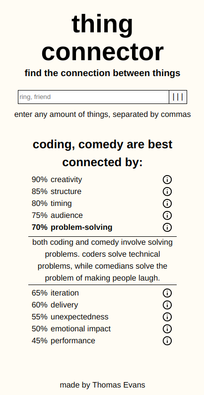

## [Live site here](https://thingconnector.netlify.app)

## About this project

This is a tool that finds connections between things using AI, and ranks them.

It's is a strange project, and about the only use case I have for this is to help with writing jokes or rap.

I've found that it is better at producing left-field connections than standard ones.

## Why this project

I just kind of wanted to mess around with AI a bunch. I thought of this in the morning and wanted to see if I could build it in a day. I did :)

### Built With:

#### AI Model:

- [Gemini 1.5 Flash](https://ai.google.dev/gemini-api/docs/models/gemini#gemini-1.5-flash)

#### Front-end:

- [React](https://react.dev/)
- [React Spinners](https://www.npmjs.com/package/react-spinners)
- [Netlify](https://www.netlify.com/)

#### Back-end:

- [Express](https://expressjs.com/)
- [Render](https://render.com/)
